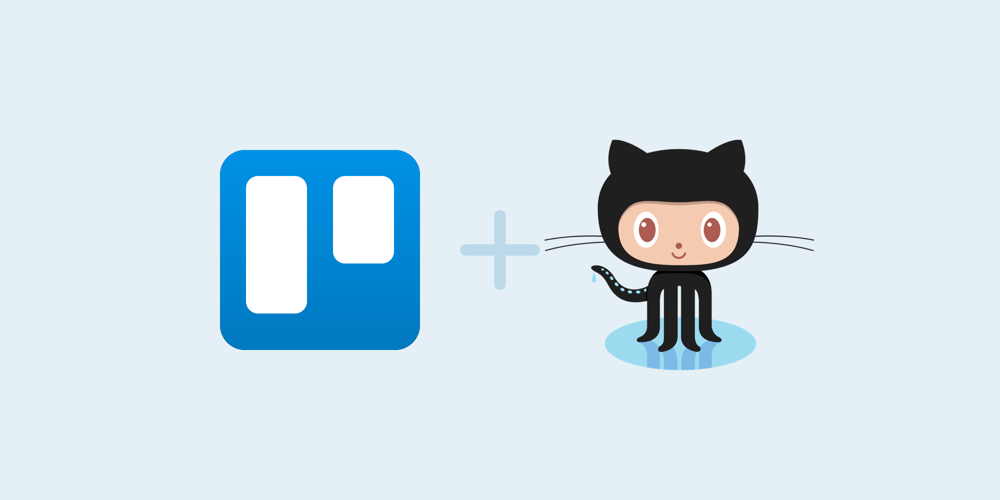
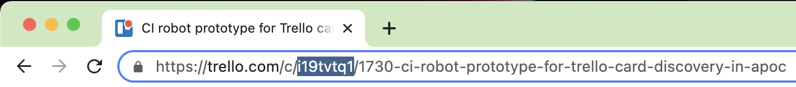

# Traceability GitHub Action



# Introduction

This GitHub Action exists for the sole purpose of linking Trello cards to git commits. So that when you look at your
project's work history in git, you can easily trace back each code change to a nicely documented Trello card. 

Depending on how you want to configure this GitHub Action for your project, you will be able to:
- enforce that git commit messages contain a Trello card short link
- enforce that PR title contain a Trello card short link
- enforce that the Trello card exists and is open
- automatically add an attachment to a Trello card containing the GitHub PR

# Commit Message Structure

Include your short link in each of your commit messages: 
- The short link needs to appear at the beginning of the commit message 
- The short link needs to be between square brackets

```bash
git commit -m "[i19tvtq1] Description of my change"
```

Trello short links can be found in the card URL. Below, the short link is highlighted in blue.



# Setup Overview

In order to enable this GitHub action, you need to add it to your existing repository and let it run on PR builds. An 
example setup is provided below, and a live one exists in 
[neo4j/apoc](https://github.com/neo4j/apoc/tree/dev/.github/workflows).

```yml
name: traceability

on:
  pull_request:
    branches:
      - dev
    types:
      - opened
      - edited
      - reopened
      - synchronize

jobs:
  validate-pr:
    runs-on: ubuntu-latest
    steps:
      - uses: AzuObs/github-action-traceability@v1.0.10
        with:
          global_verification_strategy: commits_and_pr_title
          short_link_verification_strategy: trello_or_noid
          trello_api_key: ${{ secrets.TRELLO_API_KEY }}
          trello_api_token: ${{ secrets.TRELLO_API_TOKEN }}
          github_api_token: ${{ secrets.GITHUB_TOKEN }}
```

# Setup Inputs in Detail

### global_verification_strategy

| Option                   | Descriptions                                                                                                      |
|--------------------------|-------------------------------------------------------------------------------------------------------------------|
| **commits**              | The GHA will only check the commits contained within your PR.                                                     |
| **commits_and_pr_title** | The GHA will check the commits in your PR as well as your PR title.                                               |
| **disabled**             | Disables the GHA. If you intend to permanently disable the GHA, then you should just remove it from your project. |

### short_link_verification_strategy

| Option                    | Descriptions                                                     |
|---------------------------|------------------------------------------------------------------|
| **trello**                | The GHA will only allow Trello short links.                      |
| **commits_and_pr_title**  | The GHA will allow Trello short links and also NOID short links. |

### noid_short_link_pattern

The GHA will use this regex pattern to extract NOID short links from your work descriptions. The pattern should contain 
a capture group wrapping your desire NOID tag.

### trello_api_key

Use the public key of the existing PowerUp [ManageTrelloPowerUps>GithubIntegration](https://trello.com/power-ups/639711253572cf0030b9bb20/edit/api-key).

Alternative, follow instructions [here](https://developer.atlassian.com/cloud/trello/guides/rest-api/api-introduction/#managing-your-api-key) 
and make your own power up. It takes 5 minutes, and you don't need particularly advanced privileges to create it.

### trello_api_token

Go to existing PowerUp in [ManageTrelloPowerUps>GithubIntegration](https://trello.com/power-ups/639711253572cf0030b9bb20/edit/api-key) 
and click on "Token".

Alternative, follow instructions [here](https://developer.atlassian.com/cloud/trello/guides/rest-api/api-introduction/#managing-your-api-key)
and make your own power up. It takes 5 minutes, and you don't need particularly advanced privileges to create it.

### github_api_token

Included by default in your GitHub CI.

# Contributing

Please check out [CONTRIBUTING.md](CONTRIBUTING.md).
