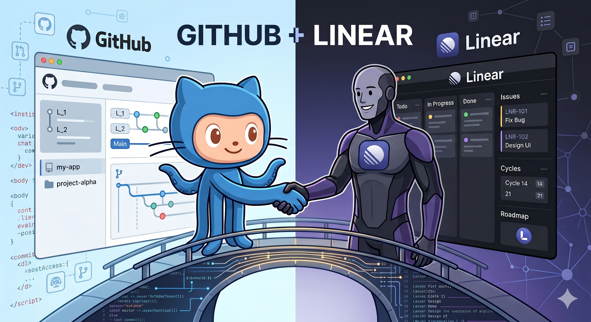

# Linear Traceability GitHub Action



A GitHub Action that enforces Linear issue traceability on pull requests. It verifies — by calling the Linear API — that every PR is either linked to a real Linear issue or explicitly opted out.

## What "linked" means

Linear's GitHub integration auto-links a PR to an issue when the issue identifier (e.g. `NEO-123`) appears in any of:

- The pull request title (bare or bracketed)
- The pull request description (with or without a closing keyword like `Closes`, `Fixes`, `Resolves`)
- The head branch name (case-insensitive substring)

Linear does **not** scan commit messages or PR comments. This action mirrors that behavior: it scans the same three locations for `[A-Z]+-\d+` substrings, then asks Linear (a) whether each referenced issue exists and (b) whether the PR is registered as an attachment on it.

When Linear has registered the link, the check passes. When the issue is missing or no attachment is registered (and won't be after a brief retry), the check fails with an actionable error.

## Strategies

| Option | Description |
|--------|-------------|
| `linked` (default) | Verifies via the Linear API that the PR is linked to at least one existing Linear issue. |
| `disabled` | No-op. Use to install the action without enforcement, e.g. while migrating. |

## Opt-out

Two mechanisms skip the check:

- **`No Linear` PR label** (case-insensitive) — apply via the GitHub UI when a PR is intentionally unrelated to any Linear issue.
- **`[NOID]` prefix in the PR title** (case-insensitive) — for example, `[NOID] Bump dependency versions`.

Either is sufficient. The action exits successfully without calling the Linear API.

## Setup

```yaml
# .github/workflows/traceability.yaml
name: traceability
on:
  pull_request_target:
    types: [opened, edited, reopened, synchronize, labeled, unlabeled]
    # no `branches:` filter — let `target_branches` (below) decide
jobs:
  traceability:
    runs-on: ubuntu-latest
    steps:
      - uses: neo4j/github-action-traceability@v3
        with:
          global_verification_strategy: linked
          github_api_token: ${{ secrets.GITHUB_TOKEN }}
          linear_api_key: ${{ secrets.LINEAR_API_KEY }}
          target_branches: |
            dev
            main
```

### Inputs

| Input | Required | Description |
|-------|----------|-------------|
| `global_verification_strategy` | no | `linked` (default) or `disabled`. |
| `github_api_token` | yes | GitHub token. The default `${{ secrets.GITHUB_TOKEN }}` works. |
| `linear_api_key` | one credential required when strategy is `linked` | Linear personal API key. Create one at **Linear Settings → Security & Access**. Store as a GitHub secret. |
| `linear_client_id` | one credential required when strategy is `linked` | Client ID of a Linear OAuth application (**Settings → API → OAuth applications**). Use together with `linear_client_secret` instead of `linear_api_key`. Takes precedence when both are configured. |
| `linear_client_secret` | with `linear_client_id` | Client secret for the OAuth application. Store as a GitHub secret. |
| `target_branches` | no | Newline-separated list of base branches the action should run against. PRs targeting any other base branch are reported as success without contacting Linear. Empty (default) means run for every base branch. |

Provide **either** `linear_api_key` **or** the pair `linear_client_id` + `linear_client_secret`. See [Choosing a Linear credential](#choosing-a-linear-credential) for the trade-offs.

Prefer `target_branches` over a workflow-level `branches:` filter when PRs in your repo can be re-targeted between branches: the workflow filter only decides whether the workflow *runs*, so once a PR has failed against `dev` and is re-pointed elsewhere, the stale red check sticks. Letting the action gate on the base branch instead means the `edited` event re-fires on a base change and the most recent run paints the check green.

### Choosing a Linear credential

The action only ever reads from Linear (issue lookups and attachment listing), so any credential with read access to the workspace works. There are two ways to supply one:

**Personal API key (`linear_api_key`).** Created at **Settings → Security & Access**. Sent verbatim as the `Authorization` header. It inherits the access of the user who created it — including private teams — so it's the simplest way to cover a whole workspace.

> ⚠️ Linear lets you set an **expiration** when you create a personal API key. A key created with a 30/60/90-day expiry will silently stop working when it lapses (the action then fails with an authorization error). Create the key with **No expiration**, and prefer a dedicated **service/bot account** over a personal login so the key survives people leaving. A workspace policy may cap the maximum key lifetime.

**OAuth client credentials (`linear_client_id` + `linear_client_secret`).** Taken from an OAuth application at **Settings → API → OAuth applications**. The action exchanges them for an "app actor" access token via the `client_credentials` grant on **every run**. Each app token is valid for 30 days, but because a fresh one is minted per run, the 30-day lifetime never bites — and the stored client secret itself does not expire (it is only invalidated when you rotate it). This is the better fit for an org-wide, person-independent integration.

> ⚠️ **You must toggle "client credentials tokens" on for the OAuth application** when creating or editing it in Linear. Without it, Linear rejects the `client_credentials` grant and the action fails with `Failed to obtain a Linear app token via client credentials`.

> ⚠️ An app actor token only sees **public** teams plus any **private** teams the OAuth application has been explicitly granted access to on its details page (a paid Linear plan is required for private-team access). If you check PRs against issues in private teams, grant the app access there, or use a personal API key instead.

> ⚠️ Linear revokes existing app actor tokens when a token is requested with a **different set of scopes**, and caps concurrent app tokens at 1000. This action always requests exactly `read`, so its own tokens are consistent — but if you reuse the *same* OAuth application for another integration that requests different scopes, the two will invalidate each other. Use a dedicated OAuth application for this action.

If both are configured, the client credentials take precedence. Configuring only one half of the pair is an error — the action fails immediately naming the missing input rather than silently falling back to `linear_api_key`, since an unset GitHub secret expands to an empty string.

## Behavior

### Retry on Linear processing latency

When a PR opens, Linear's integration takes a few seconds to register the GitHub PR as an attachment on the referenced issue. The action retries the attachment check four times over roughly 30 seconds before failing, so a brand-new PR is unlikely to flake.

### Multiple issues per PR

Linear supports multiple issue IDs in a single PR (e.g. `Fixes NEO-123, NEO-456`). The action passes when **at least one** of the referenced issues exists *and* has the PR registered as an attachment.

### Pull requests from forks

`secrets.LINEAR_API_KEY` is unavailable to workflows triggered by `pull_request` events from forks. Such PRs will fail with an authentication error. If your project accepts contributions from forks, use `pull_request_target` instead (with the standard security caveats — review the secrets exposure carefully).

## Migration from earlier versions

Earlier versions (`v1`, `v2`) used Trello and offered five string-matching strategies (`commits`, `title`, `title-or-description`, `comments`, `disabled`). All of those except `disabled` have been removed. If you used:

- `commits` — Linear does not scan commit messages, so per-commit enforcement no longer matches Linear's link-detection. Switch to `linked`.
- `title`, `title-or-description`, or `comments` — switch to `linked`. The check now covers title, description, *and* branch name in one strategy.
- `[abc123]` Trello short links in commit/title prefixes — these are no longer recognized. Use Linear-style `NEO-123` (anywhere in title, description, or branch).
- The `No Trello` label — rename to `No Linear`.
- The `trello_api_key` and `trello_api_token` inputs — remove them. Add `linear_api_key`.

Workflows that still set `global_verification_strategy: commits` (or any other removed value) will fail loudly with a migration error.

## Contributing

See [CONTRIBUTING.md](CONTRIBUTING.md).
